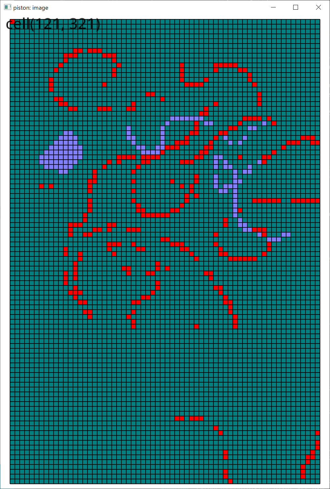
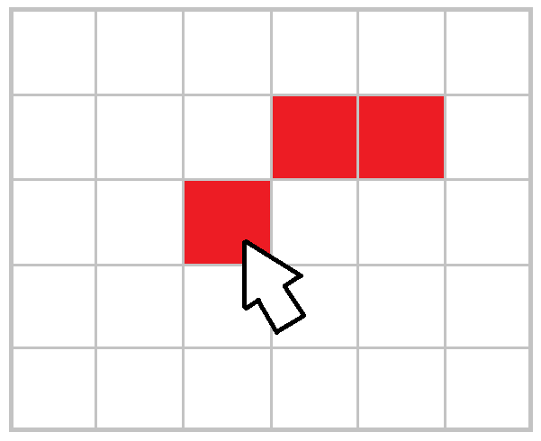

# Kusa pixel

  

This is a pixel art painting software.  
kusa is Japanese internet slang for laughing at

`m9（＾～＾）wwwww 草（＾▽＾）`  

This program will be distributed at MIT LICENSE.  

It uses the libraries of Piston, a game engine in the Rust language.  
[PistonDevelopers](https://github.com/PistonDevelopers)  

It is intended to be developed and run using Visual Studio Code on Windows.  

## Concepts

* It is a pain in the ass to create a GUI,  
so please edit the configuration file for pen thickness and other settings.
* It's a hassle, so the configuration file is not very structured and flat.
* There are no features to make your work more convenient.  
For example, there is no color palette. There is only one pen color that can be set in the settings file.
## Build

```shell
// Updating the Rust language
rustup update

// Creating an executable file
cargo build
```

## Run

```shell
cargo run --example example1
```

## Example

Your code:  

```rust
use kusa_pixel::run;

fn main() {
    run();
}
```

## Features

  

👆 Drag the mouse from where you clicked to where you passed  

## Documents

[Settings](./doc/settings.md)  
