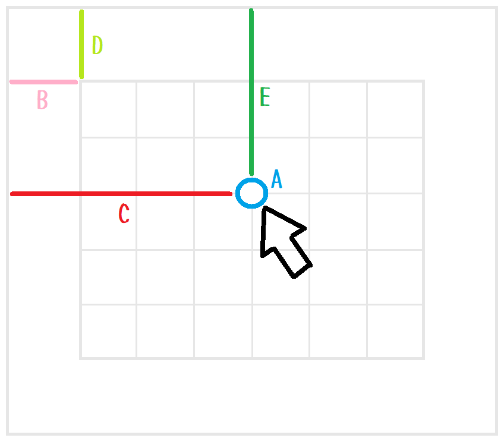
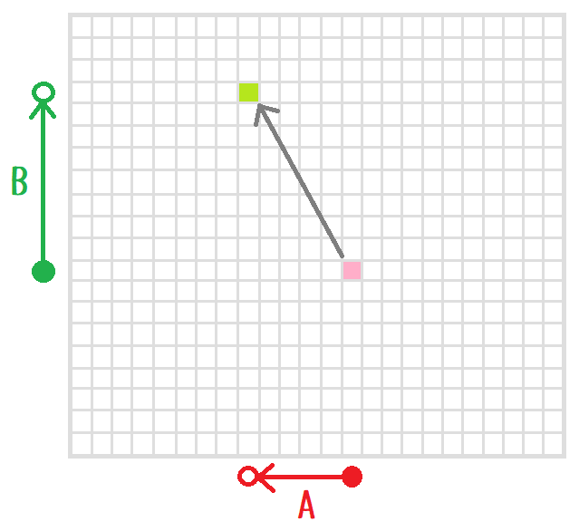
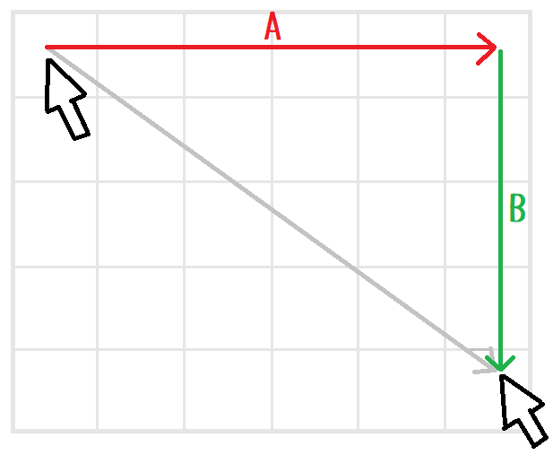
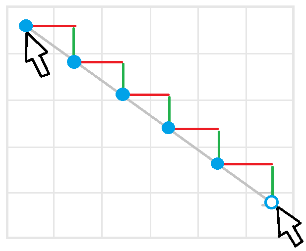
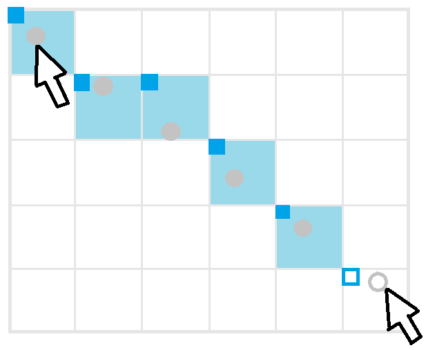

# Design

## 座標の計算

  

* `A` - Pressed point
* `B` - Margin left
* `C` - Left
* `D` - Margin top
* `E` - Top

👆　Mouse pressed point with margin.  
絵を描くとき、マージン部分にはみ出すことは多いので、マージンも含めた位置を捕捉します。  

## マウス・カーソル位置の名前

  

* `A` - Pressed point
* `B` - Previous point
* `C` - Moved vector

## 画像上のピクセル位置の名前

  

* `A` - Previous cell
* `B` - End cell

## 距離の名前

  

* `A` - D Columns
* `B` - D Rows

## 微小な移動

  

👆　微小な移動なら、描画しません  

## 二点の補間

  

* `A` - Previous point
* `B` - End point

  

* `A` - Longer side, positive
* `B` - Shorter side, positive

A:B = 6:5  

  

  
